# 2025年15款最佳Gmail团队协作工具(持续更新)

在现代商业环境中，高效的邮件协作已成为团队成功的关键因素。无论是客户服务、销售管理还是项目协作，传统的单人邮件处理方式已经无法满足现代团队的需求。Gmail作为全球使用最广泛的邮件平台，催生了众多专业的协作工具和扩展插件，帮助团队实现更高效的邮件管理和沟通协作。

这些工具通过共享收件箱、邮件分配、自动化工作流等功能，将传统的邮件处理转变为真正的团队协作体验。从简单的邮件共享到复杂的多渠道客户服务管理，这些解决方案能够显著提升团队工作效率、减少重复劳动，并确保没有任何重要邮件被遗漏。

---

## **[Gmelius](https://gmelius.com)**

Gmail共享收件箱与AI邮件助手的领先解决方案。

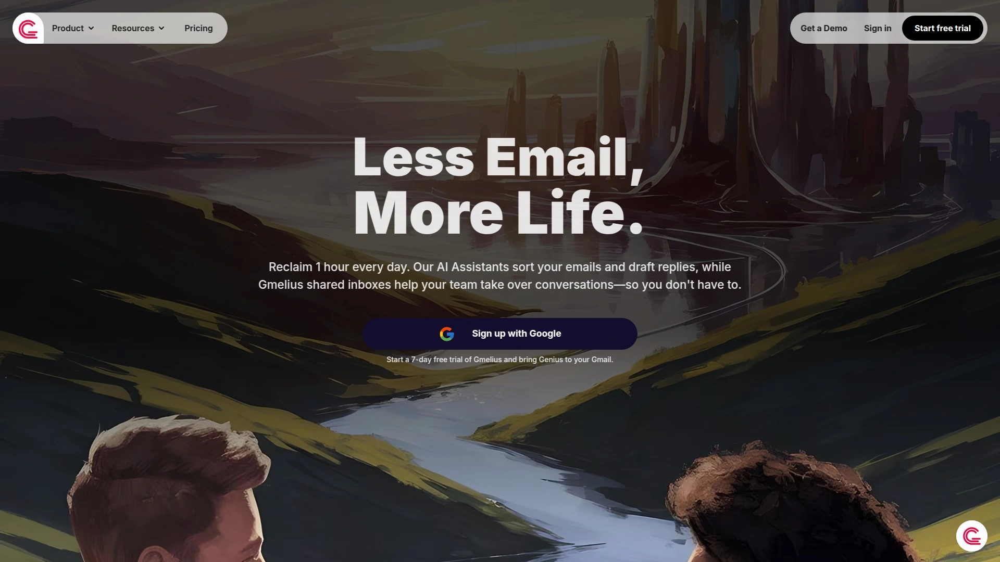

Gmelius将Gmail转换为功能强大的协作平台，提供业界领先的AI助手功能。其AI草稿助手能够自动起草邮件回复，智能分类助手可以自动整理和分发邮件，而AI调度架构师则能够设计个性化的自动化工作流。平台支持Kanban看板视图，让团队能够可视化地管理邮件和任务进度。

**核心优势包括：**深度的AI自动化功能能够处理高达70%的重复性邮件任务；无缝的Gmail集成体验让用户无需学习新界面；强大的自动化工作流支持复杂的业务流程；内部协作功能包括备注、@提及和实时状态同步。团队使用Gmelius后响应邮件的速度平均提升40%，特别适合需要处理大量邮件的客服和销售团队。

**定价模式：**Growth计划每用户每月24美元，Pro计划每用户每月36美元，提供免费试用且无需信用卡。

***

## **[Hiver](https://hiverhq.com)**

Gmail内的专业客服共享收件箱平台。

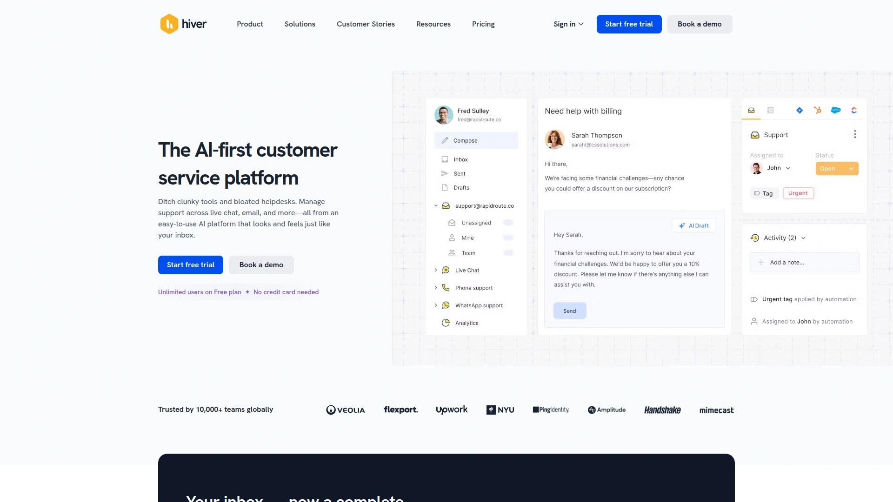

Hiver直接在Gmail界面中提供企业级的共享收件箱功能，无需切换到其他平台。其协作草稿功能允许团队成员实时共同编辑邮件回复，碰撞检测功能防止多人同时回复同一邮件。平台提供智能的邮件分配机制，支持手动分配和基于规则的自动分配。

**突出特性：**Gmail原生集成确保用户体验的连续性；SLA规则和自动化功能帮助团队遵守服务标准；客户满意度调查功能直接集成在邮件流程中；移动应用支持让团队随时随地处理客户询问。平台特别适合中小型企业的客户支持团队，提供从基础到高级的多种功能层次。

**定价结构：**提供功能有限的免费计划，付费计划从每用户每月19美元开始，核心功能如SLA管理和高级分析需要29美元和49美元的计划。

***

## **[Front](https://front.com)**

全渠道客户沟通的协作中枢。

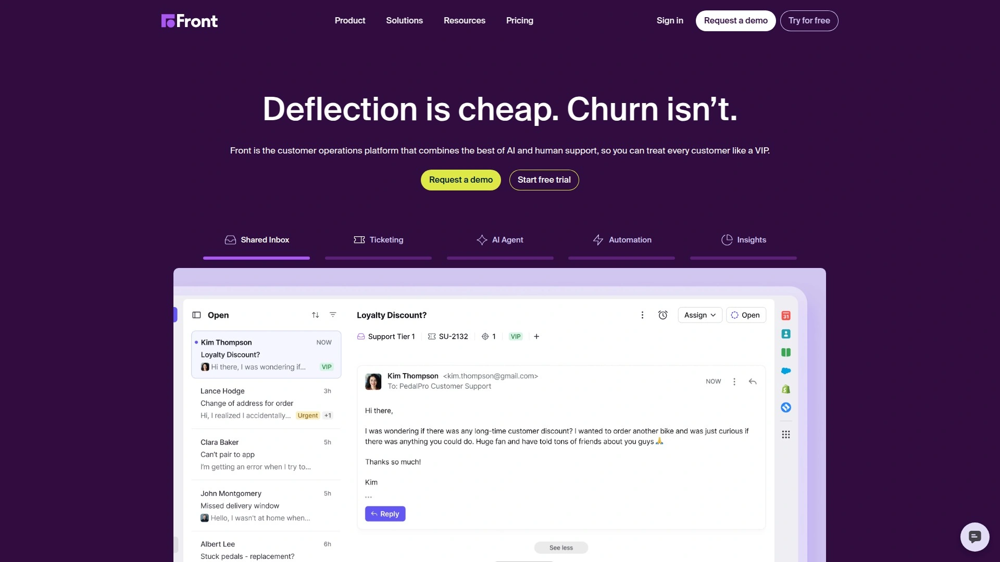

Front将邮件、社交媒体、短信、实时聊天等多个沟通渠道统一到一个协作界面中。与传统工具不同，Front允许团队成员使用个人邮箱地址回复，同时保持团队的可见性和协作功能。平台支持超过110个第三方应用集成，包括Salesforce、HubSpot、Asana等主流业务工具。

**核心竞争力：**全渠道统一管理消除了在多个应用间切换的需要；个性化沟通功能保持了人性化的客户体验；强大的工作流自动化能力支持复杂的业务流程；详细的分析报告帮助团队优化沟通效率。特别适合需要管理多渠道客户沟通的代理公司和大型客服团队。

**价格政策：**提供免费试用，具体定价采用分层结构，需根据团队规模和功能需求进行定制报价。

***

## **[Help Scout](https://www.helpscout.com)**

专业的客户服务共享收件箱解决方案。

Help Scout专为客户服务团队设计，集成了共享收件箱、帮助中心和实时聊天功能。其碰撞检测功能确保团队成员不会重复回复同一客户，内部备注系统支持团队内部的信息共享和协作。平台提供丰富的自动化功能和客户档案管理，帮助团队提供个性化的客户服务。

**专业特色：**保存回复功能确保常用回复的一致性；客户档案提供完整的互动历史；自动化工作流减少重复性任务；comprehensive报告功能提供深入的性能分析。平台在教育行业有着广泛应用，特别适合需要处理大量相似问题的客服团队。

**定价信息：**提供免费试用期，付费计划的具体价格需要根据团队规模和功能需求进行咨询。

***

## **[Missive](https://missiveapp.com)**

集成邮件与任务管理的团队协作平台。

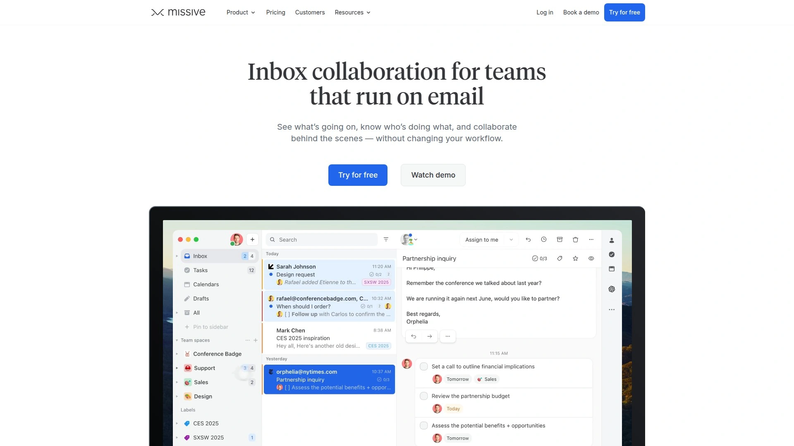

Missive不仅支持邮件协作，还整合了短信、WhatsApp、Facebook Messenger等多种沟通渠道。其独特的任务管理功能允许将任何邮件转换为任务，支持团队内的任务分配和进度跟踪。平台提供强大的自动化规则和AI集成功能，通过OpenAI API实现智能回复和邮件摘要。

**技术优势：**支持任何IMAP邮件服务商的双向同步；内置AI自动化功能如自动标记、草稿生成和对话摘要；SOC 2 Type II安全认证确保企业级数据保护；团队角色管理提供精细的权限控制。特别适合需要综合沟通和任务管理的小型团队。

**价格方案：**最多2个共享账户免费使用，付费计划从每月15美元开始，AI功能需要用户自行提供OpenAI API密钥。

***

## **[Drag](https://dragapp.com)**

Gmail内的可视化工作流管理平台。

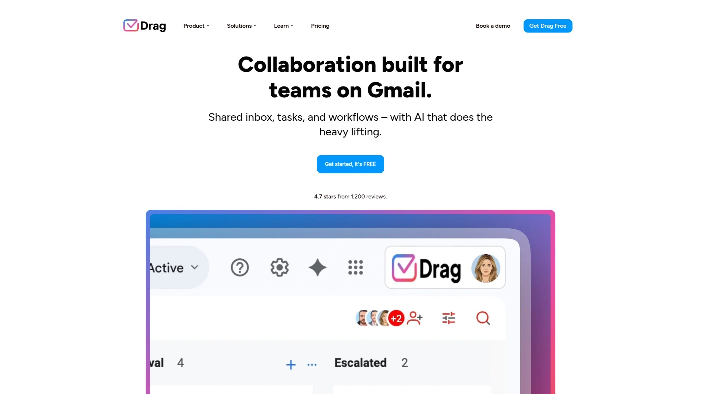

Drag将Gmail转换为类似Trello的看板界面，支持销售CRM、客服工作台和项目管理功能。平台提供拖拽式邮件整理、自动化规则和团队协作功能。其WhatsApp集成功能特别适合需要多渠道沟通的企业。全球超过20万用户在使用Drag管理他们的Gmail工作流。

**功能亮点：**Kanban看板提供直观的工作流可视化；邮件模板和序列功能支持规模化的客户沟通；自动分配和SLA监控确保服务质量；移动应用支持随时随地的团队协作。平台获得G2评选的Momentum Leader奖项，特别受到销售和客服团队的青睐。

**定价策略：**提供不需要信用卡的免费试用，付费计划根据团队规模和功能需求进行定价。

***

## **[Sortd](https://sortd.com)**

Gmail的轻量级可视化任务管理工具。

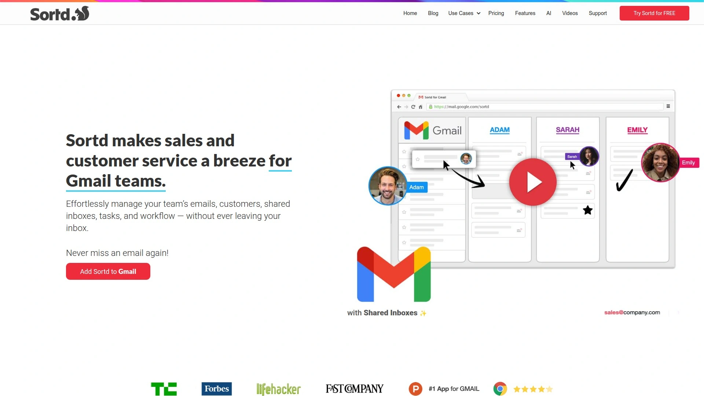

Sortd将Gmail界面转换为可定制的看板视图，支持拖拽式邮件整理和任务管理。平台提供团队共享功能，支持共享邮箱管理和实时协作。其简单直观的界面设计让团队能够快速上手，无需复杂的培训过程。

**设计理念：**专注于简化Gmail的使用体验；可定制的列表结构适应不同的工作流需求；内置的团队聊天功能支持上下文相关的讨论；集成的联系人管理帮助维护客户关系。Product Hunt评选的Gmail最佳应用，特别适合需要简单高效解决方案的小型团队。

**价格模式：**提供功能丰富的免费版本，高级功能和团队协作需要付费订阅。

***

## **[Mixmax](https://mixmax.com)**

Gmail内的AI驱动销售自动化平台。

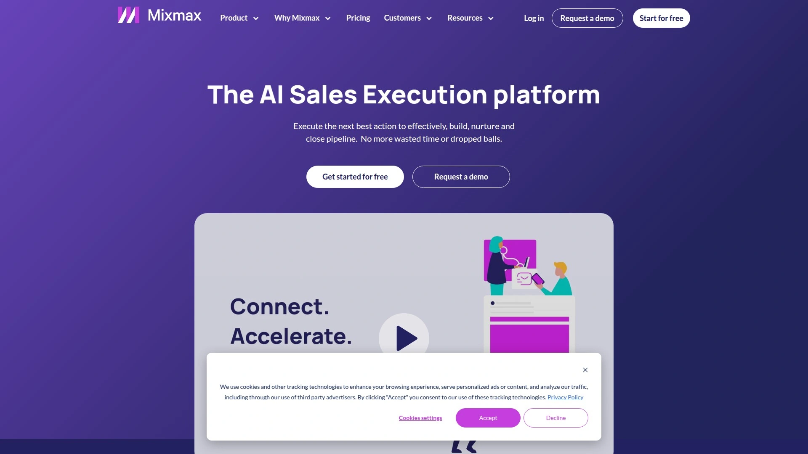

Mixmax将Gmail转换为强大的销售工具，提供邮件追踪、会议调度、邮件序列和CRM集成功能。其AI功能包括智能发送时间建议、自动化跟进和个性化内容生成。平台深度集成Salesforce和HubSpot等主流CRM系统。

**销售聚焦功能：**实时邮件和点击追踪提供即时的客户参与反馈；一键会议调度消除了来回协调的麻烦；多步骤邮件序列支持规模化的潜客培育；LinkedIn数据集成提供丰富的客户背景信息。特别适合销售和市场营销团队，能够显著提升转化率和工作效率。

**定价结构：**提供功能完整的免费计划，包括邮件追踪和会议调度；付费计划提供无限制的序列发送和高级分析功能。

***

## **[Spike](https://spikenow.com)**

创新的对话式邮件团队协作平台。

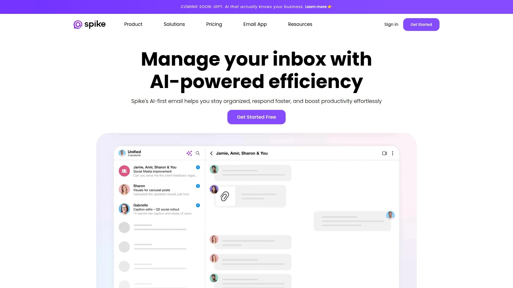

Spike将传统邮件界面重新设计为类似即时消息的对话模式，消除了邮件的形式化障碍。平台集成了团队聊天、文档协作、任务管理和视频会议功能，创造了统一的工作体验。其AI助手"Magic Message"支持内容生成和智能建议。

**创新体验：**对话式邮件界面让沟通更加自然流畅；团队空间整合了所有协作工具；支持语音消息和内联RSVP等现代化功能；跨平台同步确保信息的一致性。使用Spike的企业报告生产力提升52%，运营利润增加25%。

**价格方案：**提供基础功能的免费版本，Teamspace团队版提供完整的协作功能，具体定价需要咨询。

***

## **[Boomerang](https://boomeranggmail.com)**

Gmail的日程管理与邮件生产力专家。

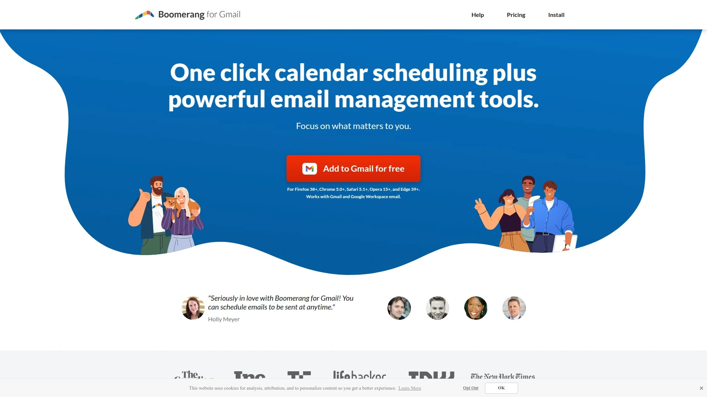

Boomerang是最早的Gmail扩展之一，提供邮件定时发送、会议调度和邮件提醒功能。其Magic Live Calendar功能能够在邮件中嵌入实时更新的日程安排，简化了会议协调过程。平台获得了Google的安全认证和SOC 2 Type 2合规认证。

**成熟稳定的功能：**邮件定时发送支持智能时间建议；会议调度功能集成多日历和时区支持；收件箱管理功能包括暂停、提醒和追踪；AI写作助手Respondable帮助提高邮件回复率。数百万用户的选择，特别适合需要频繁安排会议和管理邮件的专业人士。

**价格政策：**每月限量免费使用，无限制使用需要付费订阅，具体价格根据功能需求而定。

***

## **[Right Inbox](https://rightinbox.com)**

Gmail的全方位生产力增强工具。

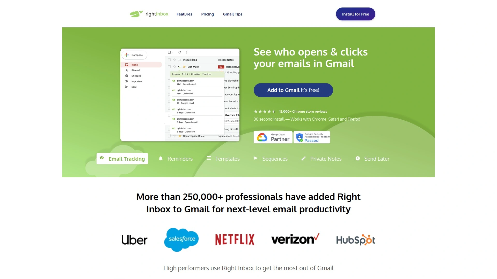

Right Inbox集成了邮件提醒、追踪、模板、定时发送等多种功能，超过25万专业用户选择使用。平台提供邮件合并、CRM同步和收件箱暂停等高级功能。其简洁的界面设计和低学习成本让用户能够快速提升邮件处理效率。

**全面的工具集：**邮件提醒确保重要邮件不被遗忘；邮件序列支持自动化的跟进流程；私人备注功能帮助记录重要信息；多签名管理适应不同的沟通场景。Chrome商店4.7星的高评分证明了其用户满意度。

**定价方式：**提供功能丰富的免费版本，付费版本解锁所有限制并提供高级功能。

***

## **[Keeping](https://keeping.com)**

Gmail专属的共享收件箱专家。

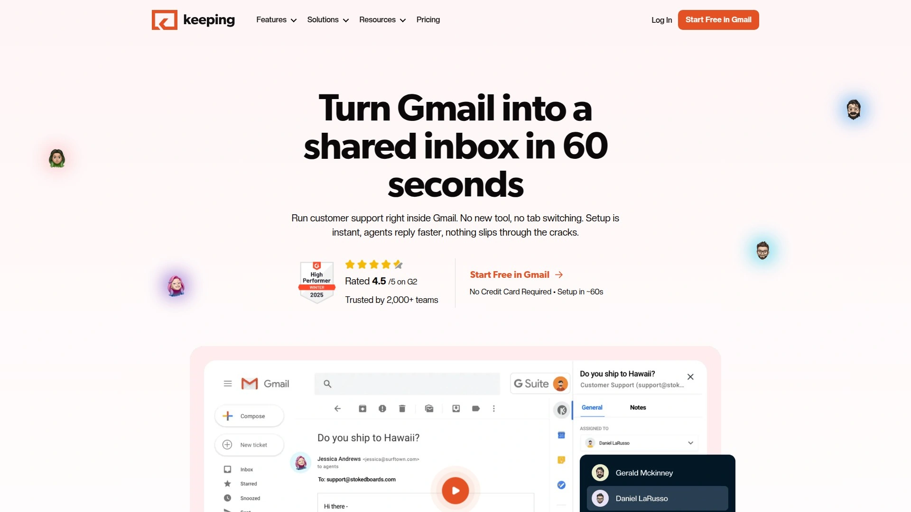

Keeping专门为Gmail用户设计共享收件箱解决方案，支持从单一Gmail账户管理多个共享邮箱。平台提供直观的权限管理和团队协作功能，确保邮件安全和访问控制。其简洁的设计理念专注于核心的共享功能。

**专注专业：**Gmail原生体验保持用户习惯的连续性；多收件箱统一管理提高工作效率；精细的权限控制确保信息安全；简单易用的界面减少学习成本。特别适合需要简单高效共享收件箱解决方案的Gmail用户。

---

## **[Zoho TeamInbox](https://zoho.com/teaminbox)**

经济实用的小企业共享收件箱。

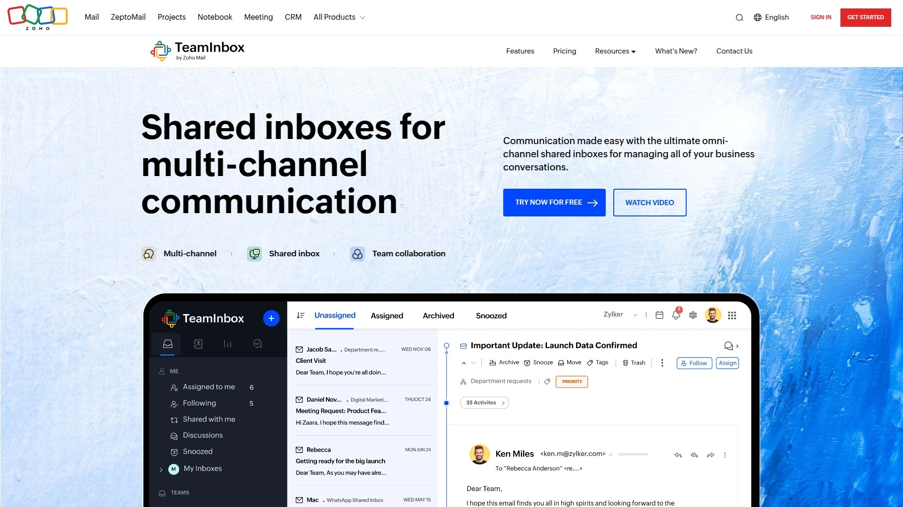

Zoho TeamInbox是Zoho生态系统的一部分，提供性价比极高的共享收件箱解决方案。平台支持多渠道整合、邮件分配和基本的自动化功能。其与Zoho其他产品的深度集成为小企业提供了完整的办公解决方案。

**经济高效：**价格实惠适合预算有限的小企业；Zoho生态集成提供一站式办公体验；基础功能完善满足日常协作需求；多渠道支持适应现代沟通方式。

***

## **[eDesk](https://edesk.com)**

电商行业的专业共享收件箱平台。

eDesk专为电商企业设计，深度集成Amazon、eBay、Shopify等主流电商平台。平台能够显示客户的订单信息和购买历史，帮助客服团队提供更精准的支持。其AI自动回复功能特别针对电商常见问题进行了优化。

**电商专业功能：**电商平台深度集成提供完整的客户信息；订单数据关联帮助快速解决问题；自动评价请求提升客户满意度；多语言支持适应全球化业务。特别适合在线零售商和跨境电商企业。

***

## **[Emailgistics](https://emailgistics.com)**

Outlook环境的共享收件箱解决方案。

Emailgistics专为Microsoft Outlook用户提供共享收件箱功能，支持轮询分配、SLA管理和团队协作。虽然主要面向Outlook用户，但其企业级功能和深度定制能力值得参考。平台提供详细的报告分析和对话历史跟踪。

**企业级特性：**Outlook原生集成确保企业环境的兼容性；轮询分配确保工作负载的均衡分配；SLA监控和提醒保障服务质量；详细的分析报告支持持续改进。

***

## 常见问题解答

**如何选择适合团队的Gmail协作工具？**

选择工具时应考虑团队规模、使用场景和预算限制。小型团队可以选择Sortd或Missive这样的轻量级解决方案，大型客服团队更适合Front或Help Scout的专业功能，而销售团队则可以重点考虑Mixmax或Drag的CRM集成能力。建议先试用免费版本或试用期，评估工具的实际使用体验。

**这些工具是否会影响Gmail的使用体验？**

大多数优秀的Gmail协作工具都采用无缝集成设计，不会破坏用户熟悉的Gmail界面。像Gmelius、Hiver这样的工具直接在Gmail内提供功能，而Spike则提供了全新但直观的邮件体验。选择工具时应优先考虑那些保持或改善用户体验的解决方案。

**如何确保团队数据的安全性？**

选择具有企业级安全认证的工具至关重要。寻找SOC 2、GDPR合规、数据加密等安全特性。Gmelius、Missive等工具都通过了严格的安全审核。同时，合理设置权限管理，定期审查团队成员的访问权限，确保离职人员及时移除访问权限。

---

## 结语

Gmail团队协作工具的选择应该基于团队的具体需求和工作流程。[**Gmelius**](https://gmelius.com)凭借其强大的AI功能和深度Gmail集成，特别适合需要处理大量邮件并寻求高度自动化的团队。其AI助手能够显著减少人工处理时间，而可视化的工作流管理帮助团队保持高效协作。

这些工具的共同目标都是将传统的邮件处理转变为真正的团队协作体验，通过智能化、自动化和可视化的方式提升工作效率。随着远程工作和数字化协作的普及，选择合适的Gmail协作工具已经成为现代团队成功的关键因素之一。
